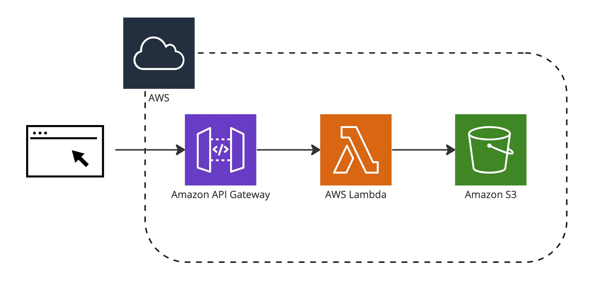
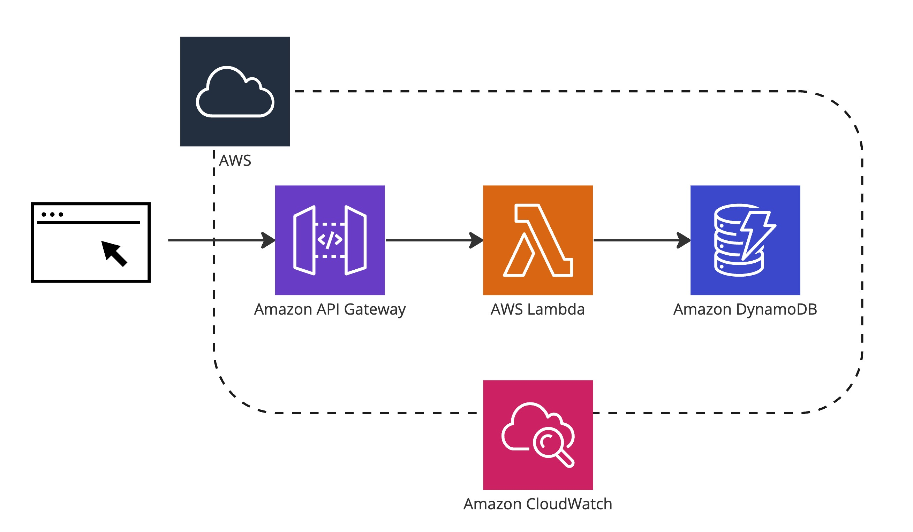

# Build a Serverless Web Application
In this tutorial, you'll create a simple serverless web application use AWS Lambda, Amazon API Gateway, Amazon DynamoDB, and Amazon S3.

## 1. S3 Uploader
[README](./s3-uploader)

Demo

## 2. Polling App
[README](./polling-app)

Demo

