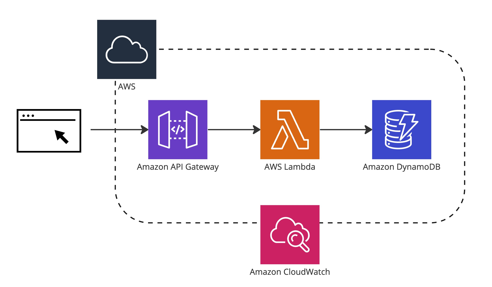

# AWS Serverless Polling App

**Architecture**

## Lambda
- Create Lambda Function
- Copy a sample function [code](./lambda/lambda_function.py)

## Frontend
- Enable a static website on Amazon S3: [userguide](https://docs.aws.amazon.com/ko_kr/AmazonS3/latest/userguide/HostingWebsiteOnS3Setup.html)
- Upload [index.html](./frontend/index.html) to S3 Static website bucket

## Dashboard
- Set cloudwatch dashboard to show results in real-time
- Copy [source](./cloudwatch/dashboard.json) to [cloudwatch dashboard](https://ap-northeast-2.console.aws.amazon.com/cloudwatch/home?region=ap-northeast-2#dashboards:)

## Benchmark and Monitoring
[Setup Benchmark environment](./benchmark/)
- Using Locust to simulate loads
- Using cloudwatch x-ray to trace the service

## References
- https://agardner.net/serverless-voting/
