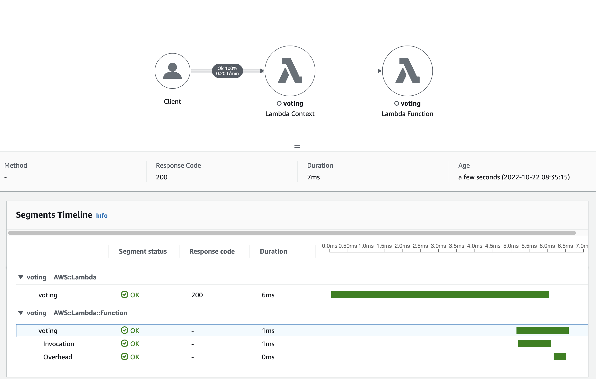

# Benchmark via Locust

## Enable AWS X-Ray in Lambda

1. Select Functions from the AWS Lambda console.
2. Choose your function.
3. On the Configuration tab, scroll down to the Monitoring tools card and select Edit.
4. Under AWS X-Ray, enable Active tracing.

## Set an Environment for locust
```bash
python3 -m venv .venv
source .venv/bin/activate
pip install locust
```

## Set the endpoint as OS value
```
export API_ENDPOINT=<YOUR_API_ENDPOINT>
```

## Run Locust
```
locust -H $API_ENDPOINT
```


## X-Ray Monitoring

Cloudwatch > X-Ray Traces

