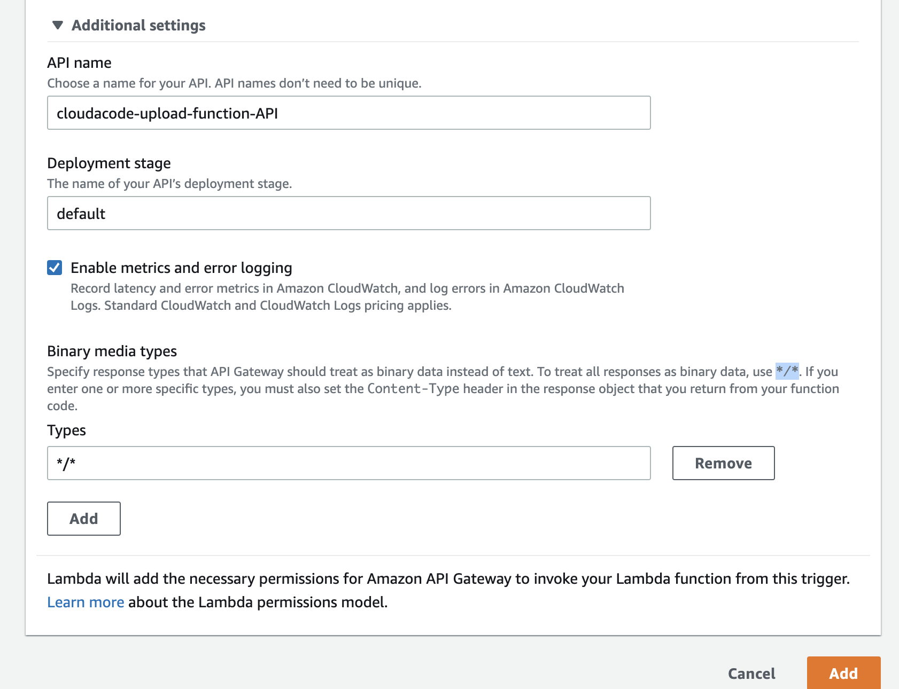

# AWS Serverless S3 File Uploader

**Architecture**


## 1. S3 Bucket
파일 업로드 스토리지용으로
[AWS S3 콘솔](https://s3.console.aws.amazon.com/s3/buckets?region=ap-northeast-2&region=ap-northeast-2)
을 통해 버켓 생성(기본 옵션)

## 2. Backend
API Gateway 에서 API를 받아서 Lambda를 호출

### Lambda
- Create Lambda Function


- Configure Permission(Add `S3 FullAccess` Policy)


- Set Environment Variable
>> KEY: `BUCKET_NAME`, VALUE: `Bucket 이름` (1. S3 Bucket에서 만들었던)


- Coding!
>> Copy from [lambda_function.py](./backend/lambda_function.py) and paste to lambda
>> 

### API Gateway
- Add an API Gateway as Lambda Tigger


- Set additional settings
>> Use `*/*` to treat all responses as binary data
>>

## 3. Frontend
S3 에서 정적 웹 사이트 구성 후 html 컨텐츠 호출

### Enable a static website on Amazon S3
https://docs.aws.amazon.com/ko_kr/AmazonS3/latest/userguide/HostingWebsiteOnS3Setup.html

!!! INFO 위에서 만든 버켓과 다른 별도의 버켓을 생성

### Website
- Froentend 폴더에 있는 [index.html](./frontend/index.html)를 S3 Static website bucket에 업로드
(favicon.ico, error.html는 선택사항)

- S3 Static Website 주소로 접속 하여 웹 페이지가 정상적으로 접속 되는지 확인


## 4. Verify

### Browser


### Curl
```
$ echo testtesttest > test.txt
$ curl -X POST https://0zxgbiijja.execute-api.ap-northeast-2.amazonaws.com/default/cloudacode-upload-function -H "Content-Type:application/octet-stream" -H "filename:test.txt" --data-binary @test.txt

test.txt file has been uploaded
```

### Postman

